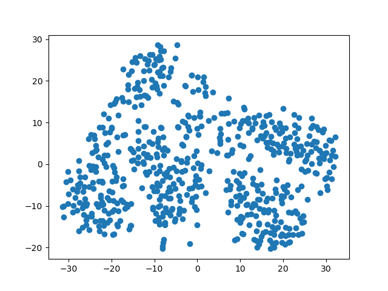
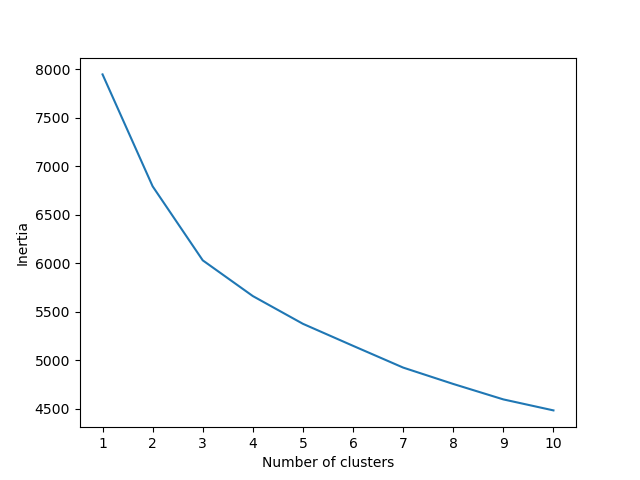

# unsupervised-machine-learning-challenge
This is an assignment for the University of Minnesota Data Analytics and Visualization Boot Camp.
 

# Myopia Unsupervised Machine Learning
Background:
You are on the data science team of a medical research company that’s interested in finding better ways to predict myopia, or nearsightedness. Your team has tried—and failed—to improve their classification model when training on the whole dataset. However, they believe that there might be distinct groups of patients that would be better to analyze separately. So, your supervisor has asked you to explore this possibility by using unsupervised learning.
 
You have been provided with raw data, so you’ll first need to process it to fit the machine learning models. You will use several clustering algorithms to explore whether the patients can be placed into distinct groups. Then, you’ll create a visualization to share your findings with your team and other key stakeholders.
 

# Results and Analysis
After reading in and cleaning the myopia data, dimensions were reduced using the PCA and t-SNE models, resulting in the below-pictured scatter plot. This plot shows that it is unlikely that clusters can be made from this data, though an argument could be made for possibly three clusters.
 

 

This find can also be backed up with the elbow curve plotted below. While the argument for three clusters could still be made, it isn't significant enough of a change to warrant that call. It would be better to inform the supervisor that clustering the patients would be ill-advised.
 

